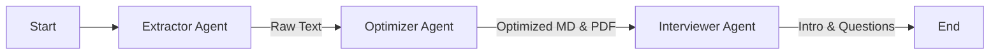

# 多智能体简历优化系统架构设计文档

## 1. 项目概述
本项目基于 **LangGraph** 和 **LangChain** 框架，构建了一个多智能体（Multi-Agent）协作系统，旨在自动化完成简历提取、内容优化、PDF生成以及面试准备材料生成等任务。系统支持国产大模型（Qwen/DeepSeek），并采用 MCP (Model Context Protocol) 标准定义工具。

## 2. 核心功能点
1. **简历解析**: 自动识别并提取 PDF/Word 格式简历的纯文本内容。
2. **智能优化**: 基于目标岗位（Job Name）和技术栈（Tech Stack），利用 LLM 对简历进行深度优化，补充高频技能点（如大模型相关技能）。
3. **格式转换**: 将优化后的 Markdown 内容自动转换为排版美观的 PDF 文档。
4. **面试辅助**: 
   - 生成 500 字专业自我介绍。
   - 生成 100 道针对性面试题（含项目、技能、架构、场景题）。
5. **交互式体验**: 命令行交互界面，实时进度条展示任务状态。

## 3. 架构设计
系统采用 **StateGraph**（状态图）架构，由以下核心组件构成：

### 3.1 核心组件
- **LangGraph**: 用于编排智能体之间的工作流。
- **LangChain**: 用于构建 Agent 和 Tool 的底层逻辑。
- **LLM Layer**: 统一接口封装，支持 DashScope (通义千问) 和 OpenAI 协议 (DeepSeek)。

### 3.2 智能体 (Agents)
系统抽象出三个核心智能体，它们通过共享状态（AgentState）进行协作：

1. **Extractor Agent (提取智能体)**
   - **职责**: 扫描目录，读取 PDF/Word 文件，提取文本。
   - **工具**: `read_resume_tool`, `save_document_tool`
   - **输出**: `original_resume_text`

2. **Optimizer Agent (优化智能体)**
   - **职责**: 调用 LLM 进行简历内容优化，生成修改总结，并生成 PDF。
   - **工具**: LLM, `generate_pdf_tool`, `save_document_tool`
   - **输出**: `optimized_resume_text`, `optimization_summary`

3. **Interviewer Agent (面试官智能体)**
   - **职责**: 基于优化后的简历，生成自我介绍和面试题库。
   - **工具**: LLM, `save_document_tool`
   - **输出**: `self_introduction`, `interview_questions`

### 3.3 信息流转 (Data Flow)


### 3.4 工具定义
在 `src/tools` 目录下定义了符合 MCP 标准的工具函数：
- `read_resume_tool`: 读取文件内容。
- `save_document_tool`: 保存文本到文件。
- `read_tech_stack_tool`: 读取外部技术栈配置。
- `generate_pdf_tool`: Markdown 转 PDF。

## 4. 目录结构说明
```text
Code/Job/
├── .env                       # 环境变量配置 (API Keys)
├── main.py                    # 系统入口脚本 (CLI & Progress Bar)
├── requirements.txt           # 项目依赖
├── prompt.py                  # Prompt 模板管理
├── architecture_design.md     # 本文档
├── data/
│   └── technology_stack.txt   # 技术栈配置文件
├── src/
│   ├── __init__.py
│   ├── state.py               # 定义 AgentState 数据结构
│   ├── graph.py               # 构建 LangGraph 工作流
│   ├── llm/
│   │   └── factory.py         # LLM 工厂模式封装
│   ├── agents/                # 智能体实现
│   │   ├── extractor.py
│   │   ├── optimizer.py
│   │   └── interviewer.py
│   └── tools/                 # MCP 工具库
│       ├── file_ops.py
│       └── pdf_ops.py
└── utils/                     # 通用工具
```

## 5. 如何调用与使用

### 5.1 环境准备
1. 安装依赖:
   ```bash
   pip install -r requirements.txt
   ```
2. 配置 `.env` 文件:
   ```ini
   LLM_PROVIDER=dashscope  # 或 openai
   DASHSCOPE_API_KEY=your_key
   ```

### 5.2 运行系统
在 `Code/Job` 目录下运行：
```bash
python main.py
```

### 5.3 交互流程
1. 系统启动后，会提示输入 **面试岗位** (如 "AI工程师")。
2. 提示输入 **工作年限** (如 "5")。
3. 系统自动加载 `data/technology_stack.txt` 中的技术栈。
4. 进度条实时显示各智能体执行情况。
5. 执行完成后，在 `Optimized_Output` 目录查看生成结果。
